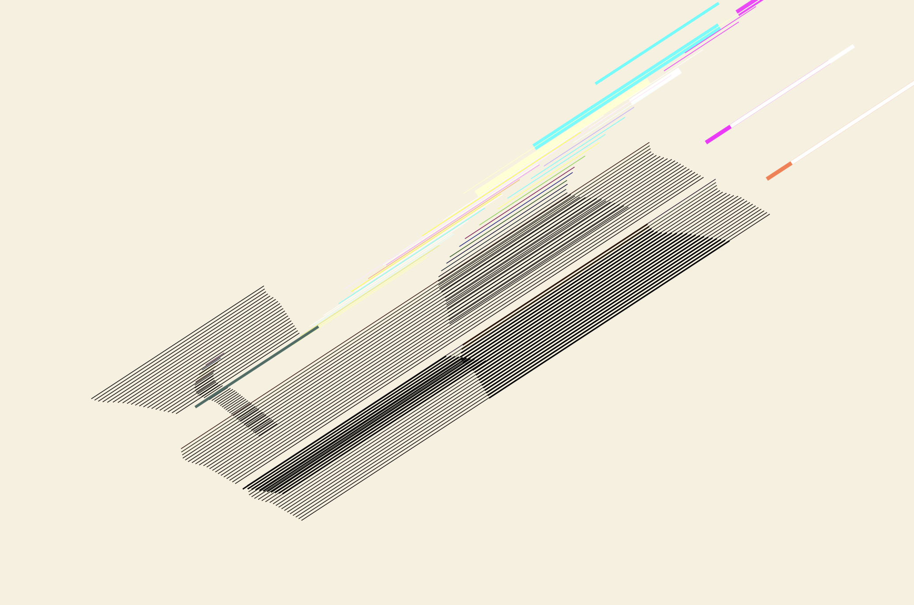

# Tut-07_Group-D_ylan0208
### 1. Instruction
Load the page and the animation will start looping in 2 seconds.
### 2. Individual approach
Make a time-based loop animation, everything moves out of the canvas and comes back. The position of the line is animated, changing based on the speed of the line.
### 3. Inspiration and concept
My design idea comes from more research about our artist Nasreen Mohamedi’s other works. Get more information from: [met museum - nasreen mohamedi exhibition](https://www.metmuseum.org/exhibitions/listings/2016/nasreen-mohamedi)

*met museum webpage screenshot*

Mohamedi worked in a largely monochromatic abstract mode and developed a rigorous practice that explored the possibilities of line on paper. When animating the lines away is what I wanted to do to break up this rigorous format, but not completely create chaos. So I decided to use numerical changes in the same direction to complete a rhythmic movement.

Also, for Mohamedi plain sheet of white paper can be a space suffused with light upon which she wielded intersecting lines that could describe rays and beams or create surfaces that shimmer. In response to that, in my personal work, I regard the original black line as a shadow and add changing colours when moving as the colour changes of light.

*code preview screenshot*
### 4. Technical explanation
Create a class Line and copy some features from group code drawLines() function into constructor. Inside the class, save initial data for later restore animation. Calculate x, y position of 2 endpoints for each line to animate. Control the animation by moving distance  - moveX and move speed - spdX.

In function draw(), use if condition constructs to decide different animation stages. 
***Stage1***: When the threshold flashY is judged to be greater than the line's attribute ys, the line will begin to move. After the line starts to move, moveX will increase according to spdX, and spdX will also increase, thus achieving the accelerated motion effect of the line.
***Stage2***: Simply use lerp to make moveX back to 0 so that lines come back to original position.

Changes to group code:
•	Rename **createLines()** function as **setLines()**, in order to avoid confusion.
•	In group **drawLines()** function, replace simple line() function with a new from class **Line**: *let l = new **Line**(x-0.55, y-0.38, length, xOff, yOff, angle, color, weight)*.
•	Remove the scale part in **windowResized()** function, use **scale()** in **function draw()** to display the artwork in the middle of the canvas.
